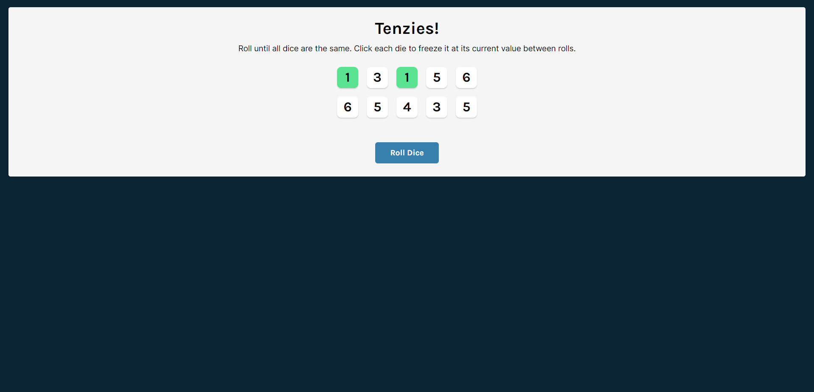

  # Tenzies!
  <h3>Roll until all dice are the same</h3>

  <!-- <a href="https://tenzi-react.netlify.app/"><h3>Try me!</h3></a>

   -->

  
  
## Technologies Used

- React
- JavaScript

## Description

 Tenzies is a random numbers dice game that demonstrates how React Hooks can be utilized (useState, useEffect).

The player needs to roll dice and freeze values until 1 value remains for all available dice.

## Screenshots

